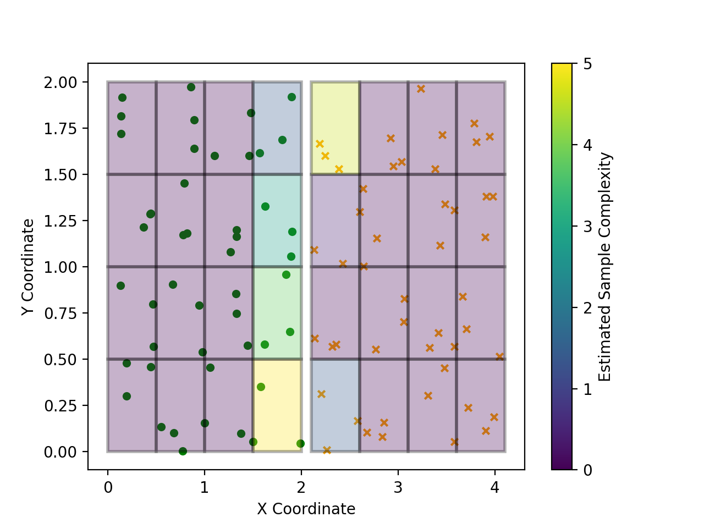
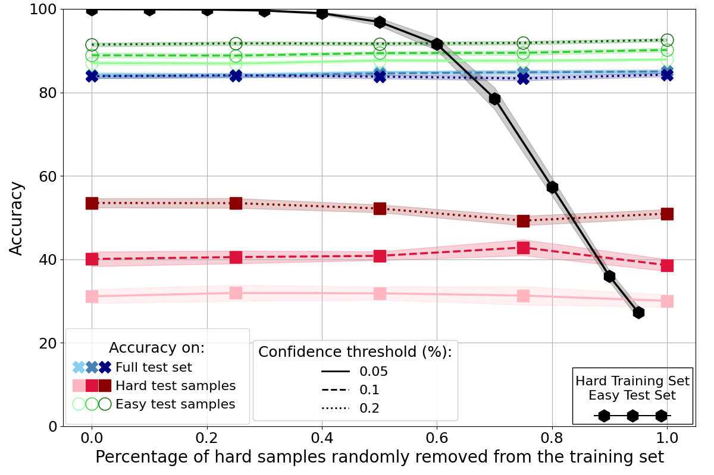
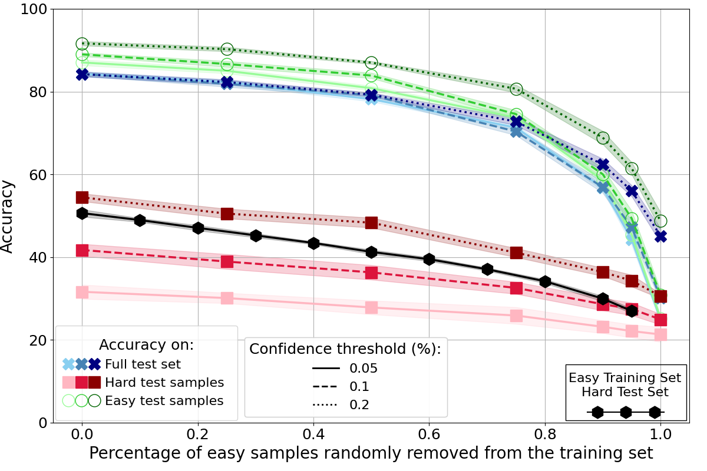

# Figure 2 - Sample complexity experiments

## Description

In the Figure 2 of our work we have shown simple experiments on 4 toy datasets. All the code for that is available in 
the `sample_complexity_experiments.py`. This program works as following:

1. Define the class manifolds, together with their neighbourhoods and sample the training data from those manifolds. 
Everything  is hard coded. In the future, it would be interesting to implement an algorithm for neighbourhood generation 
based on  density, so that it can be generalized to setting more similar to the real-world one.
2. Loop through neighbourhoods. For each neighbourhood $\mathcal{N}$.
   1. Remove all samples from $\mathcal{N}$ that are in the training set.
   2. Train ten networks on this training set.
   3. Evaluate the trained models on a test set obtained by randomly generating a thousand samples from $\mathcal{N}$.
   4. If the models did not achieve an average accuracy of over $99\%$, then sample a single point from $\mathcal{N}$ 
   into the training dataset and retrain the models from scratch.
   5. Repeat the above five times for statistical significance.
3. The average (over five runs) of the numbers of samples required from $\mathcal{N}$ to achieve an average of 
over $99\%$ accuracy is our estimate for sample complexity for $\mathcal{N}$.

## Requirements

- Python 3.x
- PyTorch
- torchvision
- matplotlib
- tqdm
- numpy

Make sure you have the required libraries installed. You can install them using pip:

```bash
pip install torch torchvision matplotlib tqdm numpy
```

## Running the Code

To run [sample_complexity_experiment.py](sample_complexity_experiment.py), use the following command in your terminal:

```bash
python sample_complexity_experiment.py --dataset [DATASET] 
```

### Parameters

- `--dataset`: Specifies which dataset to use in the experiment. This must be an integer value. The possible choices are
1, 2, 3, 4. The default choice is 1 as it's the simplest dataset.

## Expected Results

When running `python sample_complexity_experiment`, the following result is observed:



As mentioned in our paper, we notice a bias in which the model performs better on the orange crosses (right) than green 
circles (left). This means that majority of the paths along the loss landscape taken by the model result in the decision
functions that are curved towards the left side. In our initial experiments we did not find an experimental setting in
which this bias would be reversed (further experiments are required).

# Figure 3 - Hardness-based within-class data imbalance on CIFAR10

Generating Figure 3 is a three-step process. We firstly have to compute the confidences using `compute_confidences.py`, 
and then run `investigate_hardness_common_case.py` and `investigate_hardness_edge_case.py`, making sure that we specify
that we want those programs to be run on CIFAR10 (add `--dataset_name CIFAR10`). `compute_confidences.py` works as 
follows:

1. Load the entire dataset specified by `dataset_name` and normalize it. We are combining training and test data.
2. Initialize 20 models - 5 instances of 4 different architectures differing based on the dataset used 
(see the initialize_models() function in [utils.py](utils.py)).
3. Iterate through models.
   1. Train model on the entire dataset.
   2. Compute and save confidences and energies for every data sample

The results are saved in the `Results/Confidences` folder.

## Running the Code

### Computing confidences

To compute the confidence on CIFAR10 use the following command in your terminal:

```bash
python compute_confidences.py --dataset_name CIFAR10
```

The above takes around *8* hours on NVIDIA A100 GPU and *8* GB of GPU RAM. You can reduce this time by reducing the 
`model_instances` parameter.

This code was also used to generate other Figures, as computing the confidences and energies is the first part of 
almost all our experiments - they enable us to identify hard/easy samples using the confidence-based approach from 
Curriculum Learning. All the confidences are saved in the Results/Confidences folder.

#### Parameters

- `--dataset_name`: Specifies which dataset to use in the experiment. This must be a string. The possible choices are
`'MNIST'`, `'KMNIST'`, `'FashionMNIST'`, and `'CIFAR10'`.
- `--model_instances`: Used to reduce computational complexity at the expense of statistical significance. The program 
will train 4 times `model_instances` networks (1 for each architecture). Our experiments were conducted on 5 
`model_instances`, and changing this might result in different results (especially if you use lower number).

### Investigating generalization

After computing the confidences we can move to investigating the generalization onto hard and easy samples. We 
distinguish two cases: common, and edge. In the former we keep the ratio of easy:hard samples constant when splitting
the data into training and test set. This should emulate the real world scenario, as randomly splitting the samples 
should yield similar easy:hard ratios between the produced splits. In the latter scenario we put the easiest (or the 
hardest) data samples into the test set. This is to show the tremendous impact of easy:hard ratios on the perceived 
generalization capabilities and the complexity of the problem. 

To compute the generalizations in the common case run the following:

```bash
python investigate_hardness_common_case.py --dataset_name CIFAR10
python investigate_hardness_common_case.py --dataset_name CIFAR10 --remove_hard --sample_removal_rates 0.0, 0.25, 0.5, 0.75, 1.0
```

The first command measures the impact of removing easy samples from the training set on the generalization (coloured 
lines in Fig 3b), and the second command concerns removal of hard samples from the training set (coloured lines in Fig 
3a). The first code takes around *42* hours on NVIDIA A100 GPU and *16* GB of GPU RAM, and the latter takes around *57* 
hours on the same compute.

To produce the results for the edge case you should run the following:

```bash
python investigate_hardness_edge_case.py --dataset_name CIFAR10
python investigate_hardness_edge_case.py --dataset_name CIFAR10 --remove_hard
```

For the former, we put the hardest samples in the test set, making the problem easy. For the latter, the easiest samples
are put in the test set, increasing the complexity. Both of the above take around *23* hours on NVIDIA A100 GPU and *16* 
GB of GPU RAM. **IMPORTANT** - both  `investigate_hardness_common_case.py` and `investigate_hardness_edge_case.py` 
assume that you have run `compute_confidences.py` with default `model_instances`. If you changed that then you should 
modify lines *14* (of `investigate_hardness_common_case.py`) and *29* (of `investigate_hardness_edge_case.py`).

#### Parameters

Below are the parameters shared by both `investigate_hardness_edge_case.py` and `investigate_hardness_common_case.py`:

- `--dataset_name`: Specifies which dataset to use in the experiment. This must be a string. The possible choices are
`'MNIST'`, `'KMNIST'`, `'FashionMNIST'`, and `'CIFAR10'`.
- `--runs`: Specifies how many networks are trained for each training:test split and each sample removal rate. We 
default to `20`, but this can be lowered to reduce computational complexity.
- `--sample_removal_rates`: The purpose of the experiment is to see how the removal of easy/hard samples from the 
training set impact the generalization. This parameter specifies the sample removal rates (list). So 
`--sample_removal_rates 0 1.0` means that we will first train on the entire dataset (`--runs` number of times), and then 
on the dataset comprising *ONLY* hard/easy training samples (depending on the `--remove_hard`).  In our experiments we 
changed this parameter to `0.0, 0.25, 0.5, 0.75, 1.0` when running `investigate_hardness_common_case.py --remove_hard` 
to reduce the computational complexity.
- `--remove_hard`: Specifies if we want to remove hard or easy samples from the training set. In the edge case, this 
determines if we want the test set to be composed of hardest (don't raise `--remove_hard`) or easiest (raise 
`--remove_hard`) samples.

The `investigate_hardness_common_case.py` contains one additional parameter:

- `--thresholds`: In confidence-based methods we require a threshold in order to divide the samples into easy and hard.
This parameter allows us to modify those thresholds. By default, we use the thresholds of *0.05*, *0.1*, and *0.2*. This 
means that the top *5*, *10*, and *20* (respectively) percentile of the samples with the lowest average confidence (as 
measured by the `compute_confidences.py`) will be classified as hard.

## Expected Results

To plot the results you should run the following:

```bash
python produce_figure3.py 
python produce_figure3.py --remove_hard
```

Those will generate the Figures and save them in the `Figures/` directory. They should look as follows:




Note that those differ slightly from the ones used in the paper, as, back then we used `--runs 5` when working with 
CIFAR10. However, just as in our paper, we still notice: 1) miniscule impact of hard training samples on 
generalization; 2) higher performances on easy than hard samples; and 3) tremendous impact of changing the hard:easy 
ratio when splitting the data into training and test set on the perceived generalization.

# Figure 4 - Hardness-based within-class data imbalance on MNIST, KMNIST, and FashionMNIST